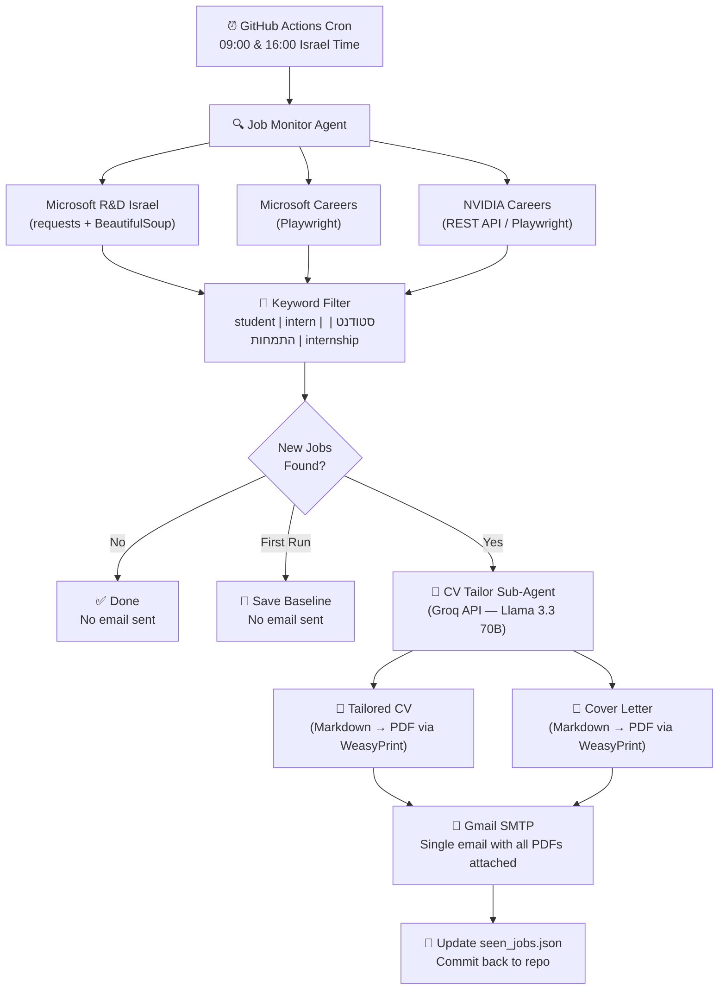

# Job Monitoring Agent

Automated job scraper that monitors Microsoft and NVIDIA career pages for student/intern positions in Israel, generates tailored CVs and cover letters per job using an LLM, and emails them to you.

## How It Works



## Project Structure

```
job-agent/
├── .github/workflows/job_check.yml   # Cron schedule + CI
├── scraper/
│   ├── main.py                        # Entry point — orchestrates everything
│   ├── sites/
│   │   ├── microsoft_rnd.py           # Static HTML scraper
│   │   ├── microsoft_careers.py       # Playwright (JS-rendered)
│   │   └── nvidia.py                  # REST API with Playwright fallback
│   └── notifier.py                    # Gmail SMTP sender
├── cv_agent/
│   ├── tailor.py                      # Groq LLM — CV + cover letter generation
│   └── pdf_renderer.py               # Markdown → PDF (WeasyPrint)
├── state/
│   └── seen_jobs.json                 # Persistent job state (auto-committed)
└── requirements.txt
```

## Setup

### 1. GitHub Secrets

Add these in **Settings → Secrets and variables → Actions**:

| Secret | Source |
|--------|--------|
| `GMAIL_APP_PASSWORD` | [myaccount.google.com/apppasswords](https://myaccount.google.com/apppasswords) (requires 2FA) |
| `GROQ_API_KEY` | [console.groq.com](https://console.groq.com) (free tier) |

### 2. First Run

Go to **Actions → Job Monitor → Run workflow**. The first run saves existing jobs as a baseline — no email is sent.

### 3. Automatic Schedule

After the baseline run, the agent runs automatically at **09:00** and **16:00** Israel time. Only new jobs trigger CV generation and email.

## Stack

- **Python 3.12**
- **BeautifulSoup** — static HTML parsing
- **Playwright** — headless Chromium for JS-rendered pages
- **Groq API** (Llama 3.3 70B) — CV and cover letter tailoring
- **WeasyPrint** — Markdown → PDF rendering
- **Gmail SMTP** — email delivery
- **GitHub Actions** — free-tier cron scheduling

## Manual Job Submission

Found a job posting yourself? Submit it manually and get a tailored CV + cover letter by email:

1. Go to **Actions → Manual Job - CV & Cover Letter → Run workflow**
2. Fill in:
   - **Job title** — e.g. `Software Engineer Intern`
   - **Company** — e.g. `Google`
   - **Job URL** — optional link to the posting
   - **Job description** — paste the full description text
3. Click **Run workflow** — you'll receive the PDFs by email within a few minutes

## Filtering

Jobs are matched case-insensitively against title + description using:

`student` · `intern` · `internship` · `סטודנט` · `התמחות`

## Email Format

One email per run (only if new jobs found):
- **Subject:** `🆕 [N] New Student Jobs | Company1, Company2 | 2026-03-30`
- **Body:** Numbered list with job title, company, and direct link
- **Attachments:** 2 PDFs per job — `OrAtias_CV_Company_Title.pdf` + `OrAtias_CoverLetter_Company_Title.pdf`
