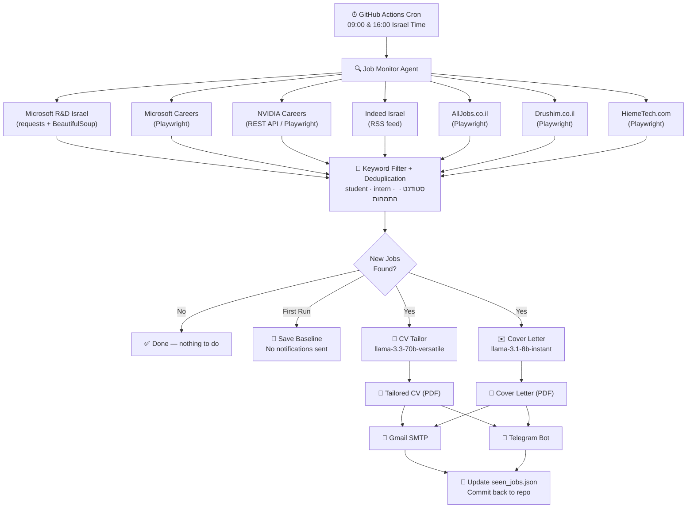

# Job Agent

Automated job monitor that scrapes 7 job boards for student/intern positions in Israel, deduplicates cross-source listings, generates a tailored CV + cover letter per job via LLM, and delivers them via email and Telegram.

Also includes a **multi-user Telegram bot** (`bot_listener.py`) — send any job URL and receive a tailored PDF within ~20 seconds. Supports up to 20 concurrent users.

## How It Works


```mermaid
flowchart TD
    A["⏰ GitHub Actions Cron\n09:00 & 16:00 Israel Time"] --> B["🔍 Job Monitor Agent"]

    B --> C1["Microsoft R&D Israel\n(requests + BeautifulSoup)"]
    B --> C2["Microsoft Careers\n(Playwright)"]
    B --> C3["NVIDIA Careers\n(REST API / Playwright)"]
    B --> C4["Indeed Israel\n(RSS feed)"]
    B --> C5["AllJobs.co.il\n(Playwright)"]
    B --> C6["Drushim.co.il\n(Playwright)"]
    B --> C7["HiemeTech.com\n(Playwright)"]

    C1 & C2 & C3 & C4 & C5 & C6 & C7 --> D["🔎 Keyword Filter + Deduplication\nstudent · intern · סטודנט · התמחות"]

    D --> E{"New Jobs\nFound?"}

    E -- No --> F["✅ Done — nothing to do"]
    E -- "First Run" --> G["💾 Save Baseline\nNo notifications sent"]

    E -- Yes --> H1["🤖 CV Tailor\nllama-3.3-70b-versatile"]
    E -- Yes --> H2["✉️ Cover Letter\nllama-3.1-8b-instant"]

    H1 --> P1["📄 Tailored CV (PDF)"]
    H2 --> P2["📄 Cover Letter (PDF)"]

    P1 & P2 --> I["📧 Gmail SMTP"]
    P1 & P2 --> J["📱 Telegram Bot"]

    I & J --> K["💾 Update seen_jobs.json\nCommit back to repo"]
```

## Project Structure

```
job-agent/
├── .github/workflows/
│   ├── job_check.yml          # Cron: runs twice daily
│   └── manual_job.yml         # Manual: paste a URL or job text → get PDFs
├── scraper/
│   ├── main.py                # Orchestrator: scrape → dedup → CV → notify
│   ├── notifier.py            # Email (Gmail SMTP) + Telegram
│   └── sites/
│       ├── microsoft_rnd.py   # Static HTML (requests + BS4)
│       ├── microsoft_careers.py # JS-rendered (Playwright)
│       ├── nvidia.py          # REST API with Playwright fallback
│       ├── indeed.py          # RSS feed (no browser)
│       ├── alljobs.py         # JS-rendered (Playwright)
│       ├── drushim.py         # JS-rendered (Playwright)
│       └── hiemetech.py       # JS-rendered (Playwright)
├── cv_agent/
│   ├── tailor.py              # Groq LLM — CV (70b) + cover letter (8b-instant)
│   └── pdf_renderer.py        # Markdown → styled PDF (Playwright/Chromium)
├── bot_listener.py            # Multi-user Telegram bot — URL → PDF on demand
├── tests/
│   ├── test_pdf_renderer.py   # HTML escaping, safe URLs, markdown conversion
│   ├── test_tailor.py         # Prompt injection, sanitization, model routing, retry
│   ├── test_cv_security.py    # CV fence-escape, injection patterns, output validation
│   ├── test_main.py           # Deduplication, seen-jobs logic, main flow
│   ├── test_notifier.py       # Email/Telegram construction, escaping
│   ├── test_sites_indeed.py   # RSS parsing, keyword matching
│   ├── test_sites_microsoft_rnd.py  # HTML parsing, fallback scraper
│   └── test_bot_listener.py   # URL detection, HTML extraction, escaping
├── state/
│   └── seen_jobs.json         # Persistent job state (auto-committed by CI)
└── requirements.txt
```

## Setup

### 1. GitHub Secrets

Add in **Settings → Secrets and variables → Actions**:

| Secret | How to get it |
|--------|---------------|
| `GROQ_API_KEY` | [console.groq.com](https://console.groq.com) — free tier |
| `GMAIL_APP_PASSWORD` | [myaccount.google.com/apppasswords](https://myaccount.google.com/apppasswords) — requires 2FA on the sender account |
| `TELEGRAM_BOT_TOKEN` | Message [@BotFather](https://t.me/BotFather) → `/newbot` → copy the token |
| `TELEGRAM_CHAT_ID` | Send any message to your bot, then open `https://api.telegram.org/bot<TOKEN>/getUpdates` and copy the `chat.id` number |

### 2. First Run (Baseline)

Go to **Actions → Job Monitor → Run workflow**. The first run saves all current jobs as a baseline — no CVs generated, no notifications sent. Only jobs that appear *after* the baseline trigger the pipeline.

### 3. Automatic Schedule

After the baseline, the agent runs at **09:00 and 16:00 Israel time** automatically.

---

## Telegram Bot (On-Demand CVs)

Run `bot_listener.py` on any machine (locally, Railway, Render, VPS):

```bash
export TELEGRAM_BOT_TOKEN=your_token
export GROQ_API_KEY=your_key
python bot_listener.py
```

Send any job posting URL to your bot in Telegram — you'll get a tailored CV + cover letter PDF back within ~20 seconds. No description copying needed; the bot scrapes the page automatically (falls back to Playwright for JS-heavy sites).

### Bot Commands

| Command | Description |
|---------|-------------|
| `/start` | Welcome message and instructions |
| `/help` | Show all options |
| `/updatecv` | Replace your stored CV |
| `/deletecv` | Permanently delete your CV and all stored data |

### CV Upload

Send your CV as:
- **Plain text** — paste directly into the chat
- **PDF** — upload a `.pdf` file (max 5 MB)
- **Word** — upload a `.docx` file (max 5 MB)

### Concurrency

The bot handles up to **20 simultaneous users**:
- `ThreadPoolExecutor(max_workers=10)` — the polling loop never blocks; each user's pipeline runs in its own thread
- `Semaphore(max=5)` on Playwright — caps Chromium instances to prevent OOM (~150–200 MB each)
- Per-user rate limit: 5 requests/minute
- Per-user file locks: safe concurrent reads/writes to user data

### Groq Rate Limits (free tier)

| Model | Used for | TPD | Users/day |
|-------|----------|-----|-----------|
| llama-3.3-70b-versatile | CV tailoring | 100K | ~20 |
| llama-3.1-8b-instant | Cover letters | 500K | ~125 |

The two models use **separate rate-limit buckets** — cover letters don't consume the CV quota. Effective ceiling: ~20 users/day on the free tier. The bot automatically retries on 429 responses, respecting Groq's `retry-after` header.

---

## Manual Submission (GitHub Actions)

Found a job yourself? Use **Actions → Manual Job — Generate CV from URL or Text → Run workflow**:

- **Easiest:** paste just the `Job posting URL` — title and description are scraped automatically
- **Fallback:** fill in title + company + description manually

PDFs are sent to your email and Telegram.

---

## Security

### Prompt Injection

- Job descriptions wrapped in `<job_data>` XML delimiters; system prompt instructs the LLM to treat content inside as raw data, not instructions
- User CV wrapped in `<cv_data>` delimiter with the same isolation guarantee
- Both inputs sanitized: control characters stripped, fence tags (`<job_data>`, `</job_data>`, `<cv_data>`, `</cv_data>`) escaped to neutralise tag-escape attacks
- LLM output validated before rendering: minimum length check, injection-pattern detection (`"ignore previous instructions"`, `"system:"`, `"jailbreak"`, etc.)

### SSRF Protection

- All user-supplied URLs resolved to IP before fetching
- Private/internal ranges blocked: `10.0.0.0/8`, `172.16.0.0/12`, `192.168.0.0/16`, `127.0.0.0/8`, `169.254.0.0/16` (AWS metadata), ULA IPv6
- Only `http://` and `https://` schemes accepted

### Input Validation

- File uploads rejected above 5 MB before download
- CV text rejected below 100 characters (too short to be real)
- Filenames sanitized to `[A-Za-z0-9]` before use in PDF names

### HTML / PDF Safety

- All LLM output HTML-escaped before rendering to PDF
- Link URLs validated: only `https://`, `http://`, `mailto:` allowed; `javascript:` and `data:` URIs replaced with `#`

### Other

- Rate limiting: 5 requests/minute per user (sliding window, thread-safe)
- Log injection: control characters and newlines stripped from untrusted strings before logging
- Bot token and API keys via environment variables only, never in source

---

## Deduplication

The same job often appears on multiple boards (e.g. Microsoft R&D Israel + Microsoft Careers). After scraping, all results are deduplicated by normalized `(title, company-brand)` key. Among duplicates, the entry with the richest description is kept for CV generation. Company aliases are resolved (e.g. "Microsoft R&D Israel", "Microsoft Careers", "Microsoft" → `microsoft`).

---

## Job State & Retry Logic

State is stored in `state/seen_jobs.json` and committed back to the repo by CI after each run.

| State | Behaviour |
|-------|-----------|
| Never seen | Included as new — CV generated |
| First-run baseline (`baseline: true`) | Skipped forever |
| CV sent successfully (`sent_at: <timestamp>`) | Skipped |
| Scraped but email failed (no flags) | **Retried** on next run |

---

## Running Tests

```bash
pip install -r requirements.txt
python -m pytest tests/ -v
```

207 unit tests, 2 integration skips (PDF render — requires Playwright with Chromium).

| Test file | What it covers |
|-----------|----------------|
| `test_cv_security.py` | CV fence-escape attacks, injection-pattern detection, `_sanitize_cv_input`, `_validate_llm_output` |
| `test_tailor.py` | Prompt structure, model routing (70b/8b split), Groq 429 retry logic |
| `test_pdf_renderer.py` | HTML escaping, safe URL validation, markdown-to-HTML conversion |
| `test_main.py` | Deduplication, seen-jobs migration, baseline, retry logic, full pipeline mocked |
| `test_notifier.py` | Email body/subject/attachment, Telegram API calls, MarkdownV2 escaping |
| `test_sites_indeed.py` | RSS parsing, keyword matching, network failure handling |
| `test_sites_microsoft_rnd.py` | HTML card parsing, link fallback, stable IDs |
| `test_bot_listener.py` | URL detection, HTML extraction from job pages, Playwright fallback |

---

## Stack

| Layer | Tool |
|-------|------|
| Scheduling | GitHub Actions (free tier) |
| HTTP scraping | `requests` + `BeautifulSoup` |
| JS-rendered pages | `playwright` (headless Chromium) |
| RSS parsing | `xml.etree.ElementTree` (stdlib) |
| CV generation | Groq API — llama-3.3-70b-versatile |
| Cover letter generation | Groq API — llama-3.1-8b-instant |
| PDF rendering | Playwright (Chromium print-to-PDF) |
| Email | Gmail SMTP (App Password) |
| Telegram | Bot API (long-polling, 10-worker thread pool) |
| Tests | `pytest` + `pytest-mock` |
